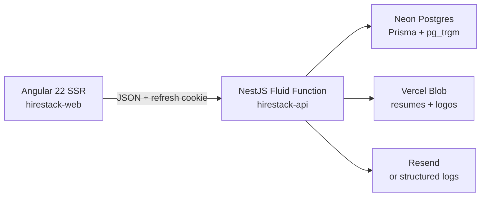

# HireStack

A two-sided job and freelance marketplace for people who want hiring software that behaves like a product, not a CRUD demo.

**Candidates** search crawlable listings, keep a resume history, apply once per job, and watch a real pipeline. **Employers** claim one company, post roles, and move applicants only along legal transitions. **Admins** suspend users, unpublish jobs, and clear the report queue.

## Who it is for

Independent recruiters, early-stage operators, and portfolio reviewers who need evidence of RBAC, SSR search, file uploads, and a live deploy — not another todo app with a login screen.

## Architecture



One pnpm monorepo. Two Vercel projects. Shared enums live in `packages/shared` so the UI cannot invent a status the API does not understand.

## Domain

Jobs are `DRAFT | PUBLISHED | CLOSED`. Applications are a state machine, not a free-text dropdown:

```
SUBMITTED → REVIEWING → INTERVIEW → OFFER → HIRED
SUBMITTED / REVIEWING / INTERVIEW → REJECTED
Candidate may WITHDRAWN from SUBMITTED or REVIEWING only
```

Illegal transitions return **409** with `error: ILLEGAL_TRANSITION`. Apply + first `ApplicationEvent` run in a Prisma transaction. Duplicate `(jobId, candidateId)` is rejected.

Search uses `ILIKE` plus `pg_trgm` GIN indexes on `Job.title` and `Job.location`. Relevance sort ranks trigram similarity when `q` is present.

## Stack and why

| Choice | Why |
| --- | --- |
| Angular 22 | Signal Forms, `httpResource`, `@Service()`, zoneless + OnPush default, Angular Aria |
| NestJS on Vercel Fluid | One function, zero-config `src/main.ts` + `PORT` detection. API runtime is Node `22.x` (Fluid Node 24 currently crashes this Nest boot). |
| Neon + Prisma adapter | Serverless pooling without a standing Node process |
| Vercel Blob | Serverless uploads; no local disk |
| Postgres search | Honest v1. Dedicated search is the upgrade, not the starting point |

## Local setup

```bash
corepack enable
pnpm install
cp .env.example apps/api/.env
# fill DATABASE_URL, DATABASE_URL_UNPOOLED, JWT secrets
pnpm prisma:migrate:dev
pnpm prisma:seed
pnpm dev
```

- API: http://localhost:3000/api/health and http://localhost:3000/api/docs
- Web: http://localhost:4200 (`environment.development.ts` points at the local API)

## Seed accounts

Password for every seed user: `HireStack!2026`

| Role | Email |
| --- | --- |
| Admin | `admin@hirestack.dev` |
| Employer (Northwind Labs) | `employer.northwind@hirestack.dev` |
| Employer (Atlas Freight) | `employer.atlas@hirestack.dev` |
| Employer (Lumen Studio) | `employer.lumen@hirestack.dev` |
| Candidate | `candidate.alex@hirestack.dev` … `candidate.quinn@hirestack.dev` |

Seed load: 1 admin, 3 employers/companies, 8 candidates, 25 skills, 20 published jobs, 18 applications.

## MCP deploy notes

1. **Neon MCP** — project `hirestack` (`divine-moon-46584975`). Schema applied with Prisma migrate; trigram indexes in `prisma/migrations/20260819160618_trgm_indexes`. Seed verified through `run_sql` / `inspect_database`.
2. Wire `apps/api/.env` with the pooled `DATABASE_URL` and unpooled `DATABASE_URL_UNPOOLED`.
3. **Vercel MCP / CLI** — projects `hirestack-api` (`prj_xDMCF55ThMXgZyVqeKVmuht4br7n`, root `apps/api`) and `hirestack-web` (`prj_vg09GADHx67h4aBvEsAgc5FpoUlZ`, root `apps/web`) live on team `criscode2022s-projects`. Cursor Origin git linking needs a Vercel Login Connection. There is no env-var MCP tool; set secrets with `vercel env add` after `VERCEL_TOKEN` is available:
   ```bash
   export VERCEL_ORG_ID=team_XDogXucjsiIPPOiJSxbMGbSc
   npx vercel env add DATABASE_URL production --yes
   npx vercel env add DATABASE_URL_UNPOOLED production --yes
   npx vercel env add JWT_ACCESS_SECRET production --yes
   npx vercel env add JWT_REFRESH_SECRET production --yes
   npx vercel env add BLOB_READ_WRITE_TOKEN production --yes
   npx vercel env add WEB_ORIGIN production --yes
   npx vercel --prod --yes
   ```
4. Deploy API first, set `WEB_ORIGIN` to `https://hirestack-web.vercel.app`, then deploy web.
5. Confirm `/api/health` returns `{ ok: true, db: true }` and `/api/docs` loads.

## Tests

```bash
pnpm test            # API unit tests (no live database)
pnpm test:smoke      # health, jobs, billing, seed login against local API + Neon
pnpm test:e2e        # Playwright against http://localhost:4200
pnpm typecheck
```

CI runs install, Prisma generate, unit tests, API lint/typecheck, and a development Angular build.

## Live URLs

- Web (production): https://hirestack-web.vercel.app
- API (production): https://hirestack-api.vercel.app/api/health
- Swagger: https://hirestack-api.vercel.app/api/docs
- Neon project: `hirestack` (`divine-moon-46584975`)
- Vercel dashboards: [hirestack-api](https://vercel.com/criscode2022s-projects/hirestack-api) · [hirestack-web](https://vercel.com/criscode2022s-projects/hirestack-web)

Production Angular calls `/api`, and `apps/web/vercel.json` rewrites that path to `https://hirestack-api.vercel.app/api` so preview and production web share one origin. Production promote uses `scripts/deploy-vercel.sh` (needs `VERCEL_TOKEN`) or a push to `main` after GitHub Git integration. GitHub also deploys preview apps `hirestack-nestjs-api` and `hirestack-angular-web`; copy `DATABASE_URL`, JWT secrets, and `WEB_ORIGIN` to Preview or the Nest function boots without a database.

## Trade-offs

- **SSR vs CSR.** Public job list, job detail, company profile, and landing render on the server so listings stay crawlable. Authenticated inbox and forms stay client-rendered.
- **Serverless Nest cold starts.** One Fluid Function is operationally simple. The cost is a wake-up on idle. Prisma uses the Neon adapter so the function does not hold a brittle TCP pool.
- **Postgres search vs dedicated search.** Trigram + `ILIKE` is enough for tens of thousands of jobs and keeps ranking next to relational filters. At marketplace scale, embeddings or OpenSearch would replace the relevance path only.

## What is next

Stripe Checkout for live cards, custom domains, and embedding search. Messaging, featured inventory, and demo billing are in this build.

## License

Private portfolio project.
